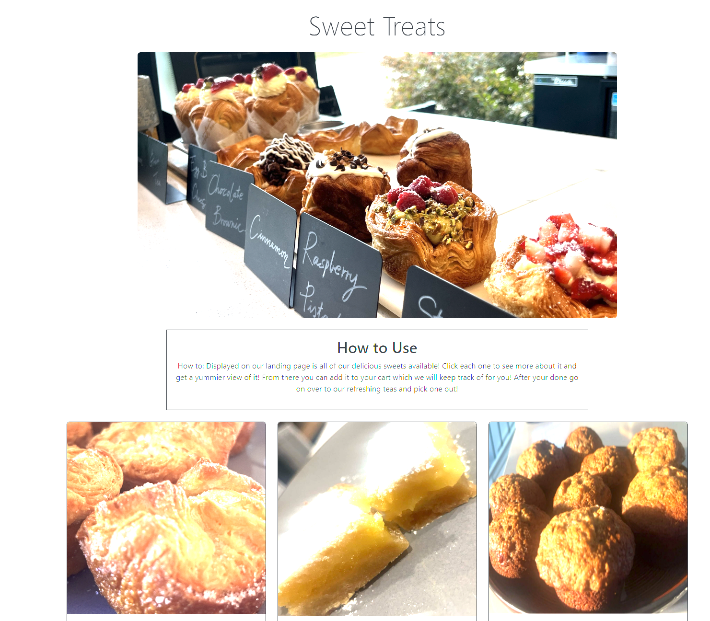

### Project Title

Sweet Treats

### Project Description

A storefront webpage of pastries for customers to view sweet treats and make a selection for purchase.

### User Story

As a baker I want an online storefront so that I can market and sell my baked goods. I want to display images of my items available so the customer can make their decision and know exactly what to expect. The customer will be able to browse available pastries and add item to a cart for purchase.

As a customer I want to be able to browse baked goods so that I can buy them. I want to know what I am buying and would like to make a purchase online to avoid waiting in line in person.

### Screenshot of application

### Link to deployed application

https://ikealmighty.github.io/bootcamp-project-1/
