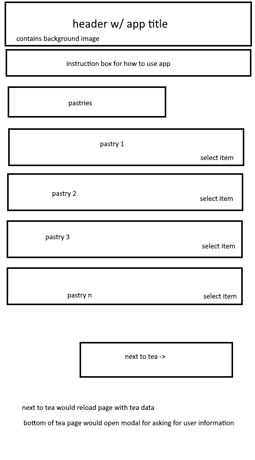

# Edex Bootcamp Project 1

## Day 1

### Project Title

Sweet Treats

### Project Description

A storefront webpage for pastries and tea

### User Story

As a baker I want an online storefront so that I can market and sell my baked goods and teas.

As a customer I want to be able to browse baked goods and teas so that I can buy them

### Wireframe or sketch of the design

### Rough breakdown of tasks

-   storefront.html
-   styling using tailwind
-   connecting tailwind
-   javascript for changing the page dynamically
-   IF dynamic page change takes too long we can just make another html page
-   javascript for storing user selected teas and bakery items in localstorage
-   modals for enlarging images
-   if we have time: show pairings

## General Workflows & Advice from Eric

-   Scrum meeting everyday (could be over text? idk)
-   get help in this order: GROUP -> TAs & Eric
